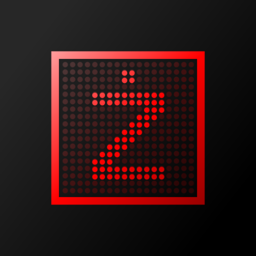

# Tablica Znakowa

<p align="center">
  
</p>

## Przegląd

Tablica Znakowa to emulator klasycznej tablicy LED instalowanej bardzo często w kościołach, na basenach czy stadionach.
Bazuje ona na produkcie firmy MKEiA przeznaczonej do wyświetlania pieśni, zatem zachowuje identycznie i wykorzystuje ten
sam protokół. Oznacza to, że można wykorzystać istniejące narzędzia do komunikacji z aplikacją.

Emulator dostępny jest na trzy najpopularniejsze platformy: Windows (komputery osobiste), Linux (mikrokomputery) oraz
Android (telewizory). Oznacza to, że możesz z niej korzystać w dowolnym miejscu i w dowolnej formie!

**Uwaga!** Tablica Znakowa to jedynie emulator! Nie posiada żadnej pamięci i nie pozwala wyświetlać nic sam z siebie.
Do pełnego działania wymagana jest również aplikacja kliencka: *Pieśni* lub *Edytor Pieśni* od MKEiA albo [*Prezenter*](http://192.168.40.2:3000/ZupaNET-publiczne/tablica) od
ŻupaNET Development.

## Instalacja

Aplikacja nie wymaga dodatkowych zależności do działania poza tym, co jest dostarczane razem z nią.

### Windows i Android

Wystarczy pobrać instalator/zip/apk z zakładki **Releases** i zainstalować na docelowym komputerze/tablecie/telewizorze.

### Linux

Ze względu na charakterystykę aplikacji zalecane jest skompilowanie jej na docelowej platformie. Patrz [**Kompilacja**](#kompilacja)

## Konfiguracja

Tablica Znakowa nie wymaga dodatkowej konfiguracji. Po uruchomieniu jest gotowa do działania. Domyślnie nasłuchuje na
wszystkich adresach IP i na porcie **60023**. Na Windows i Linux istnieje opcja zmiana niektórych ustawień w pliku konfiguracyjnym:
- Windows: `%appdata%\ZupaNET Development\Tablica Znakowa\tablica.ini`
- Linux: `~/.local/config/ZupaNET Development/Tablica Znakowa/tablica.ini`

W przypadku Androida nie ma możliwości łatwej modyfikacji pliku konfiguracyjnego zatem należy skorzystać z [**Menu Serwisowego**](#menu-serwisowe)

Opis pliku konfiguracyjnego:
- `ip` - adres IP, na którym tablica nasłuchuje
- `port` - port, na którym tablica nasłuchuje
- `padding` - odstęp (w pikselach) tekstu od lewej i górnej krawędzi ekranu
- `fullscreen` - włącza tryb pełnoekranowy (na Androidzie jest zawsze włączony)
- `background` - kolor tła w formacie hex (np. #000000)
- `foreground` - kolor czcionki w formacie hex (np. #FF0000)

Przykładowy plik konfiguracyjny:
```ini
[server]
ip=0.0.0.0
port=60023

[display]
padding=8
fullscreen=0
background=#000000
foreground=#ff0000
```

# Menu Serwisowe

Dla systemów opartych o Android (głównie telewizorów) i tam, gdzie nie ma możliwości modyfikacji plików systemowych, zostało
przygotowane menu serwisowe, które pozwala zmieniać wyżej wskazane ustawienia. Aby przejść do menu serwisowego należy po 
uruchomieniu tablicy wcisnąć w ciągu 5 sekund kombinację: **GÓRA GÓRA DÓŁ DÓŁ LEWO PRAWO LEWO PRAWO OK/ENTER**. Menu można
opuścić bez zapisywania naciskając **ESC/BACK**. D-Padem/strzałkami możemy poruszać się po menu. Kliknięcie OK/ENTER wybiera
opcję, z kolei ESC/BACK anuluje wybór. 

Po wybraniu danej opcji do edycji możemy klawiaturą numeryczną wpisywać cyfry. Przyciskiem OK/ENTER zatwierdzamy, a ESC/BACK
kasujemy ostatnią cyfrę/znak. Jeżeli skasujemy wszystkie cyfry/znaki to ponowne naciśnięcie ESC/BACK anuluje edycję opcji.

**Jeżeli wpisujemy adres IP lub kolor to naciśnięcie przycisku RIGHT wpisze nam kolejno kropkę lub przecinek.**

Po zapisaniu ustawień tablica powróci do trybu wyświetlania, ale nowe ustawienia zostaną zapisane dopiero po zrestartowaniu
aplikacji.

**Wyłączyć aplikację możemy również w trybie wyświetlania naciskająć ESC/BACK**.

# Kompilacja

Kompilacja aplikacji na wszystkie platformy jest bardzo prosta, ale na początku należy zainstalować potrzebne narzędzia.
Dla systemu Windows zalecane jest zainstalowanie kompilatora **LLVM+CLang+MinGW** (np. [tego](https://github.com/mstorsjo/llvm-mingw) - **najlepiej za pomocą WinGet**),
a także narzędzia **CMake** oraz dowolnego interpretera **Python** (wymagany do kompilacji SDL3). W przypadku systemu Linux
wykorzystujemy wybrany przez nas kompilator (własny albo z repozytorium). Dla Androida to, co Google Inc. dla nas przygotował.
Tablica Znakowa zadziała na wszystkim, na czym zadziała SDL3, SDL3_ttf i SDL3_net. Do Windowsa przyda się również InnoSetup,
jeżeli interesuje nas generowanie instalatorów.

### Właściwy proces
1. Klonujemy repozytorium: `git clone http://192.168.40.2:3000/ZupaNET-publiczne/vmkeia.git`
2. Wywołujemy odpowiedni preset CMake z katalogu głównego projektu: `cmake --preset <nazwa>` (listę można wyświetlić: `cmake --list-presets`)
3. Kompilujemy projekt: `cmake --build --preset <nazwa>` (listę można wyświetlić: `cmake --build --list-presets`)

Jeżeli wszystko się uda, to aplikacja zostanie wybudowana w katalogu:
- Windows: `build/<preset>/bin`
- Linux: główna binarka i zasoby `build/<preset>/bin`, a biblioteki `build/<preset>/lib`

W przypadku systemu Android zostaną skompilowane tylko biblioteki C. Aby wbudować apk, należy wydać polecenie: `cmake --build --preset <nazwa> --target apk`.
Wygenerowany APK będzie w katalogu: `build/<preset>/android/app/build/outputs/apk`.

Aby wybudować instalator na systemy Windows, należy wydać polecenie `cmake --build --preset <nazwa> --target installer`.
Aby spakować do ZIP-a, wystarczy `cmake --build --preset <nazwa> --target zip-package`.

# Licencja

Tablica Znakowa dostępna jest na licencji GNU General Public License 2.0 i żadnej innej. Treść tej licencji znajduje się w pliku COPYING.  
Copyright (C) 2026 ŻupaNET Development

Aplikacja wykorzystuje biblioteki **SDL3**, **SDL3_tff** oraz **SDL3_net** dostępne na licencji [zlib](https://github.com/libsdl-org/SDL/blob/main/LICENSE.txt).

Aplikacja wykorzystuje następujące czcionki:

- **CozetteVector**  
  Copyright (c) Cozette contributors  
  Licensed under the MIT License.  

- **MiniForma2**  
  Copyright (c) Bartek Nowak (barmee)  
  Freeware font. Usage subject to original license terms.  

- **MiniSet2**  
  Copyright (c) Bartek Nowak (barmee)  
  Freeware font. Usage subject to original license terms.  

- **Monocraft**  
  Copyright (c) 2022 Idrees Hassan  
  Licensed under the SIL Open Font License, Version 1.1.  

- **FreeSans**  
  Copyright (c) Primož Peterlin and Steve White  
  Licensed under the GNU General Public License, version 2.
