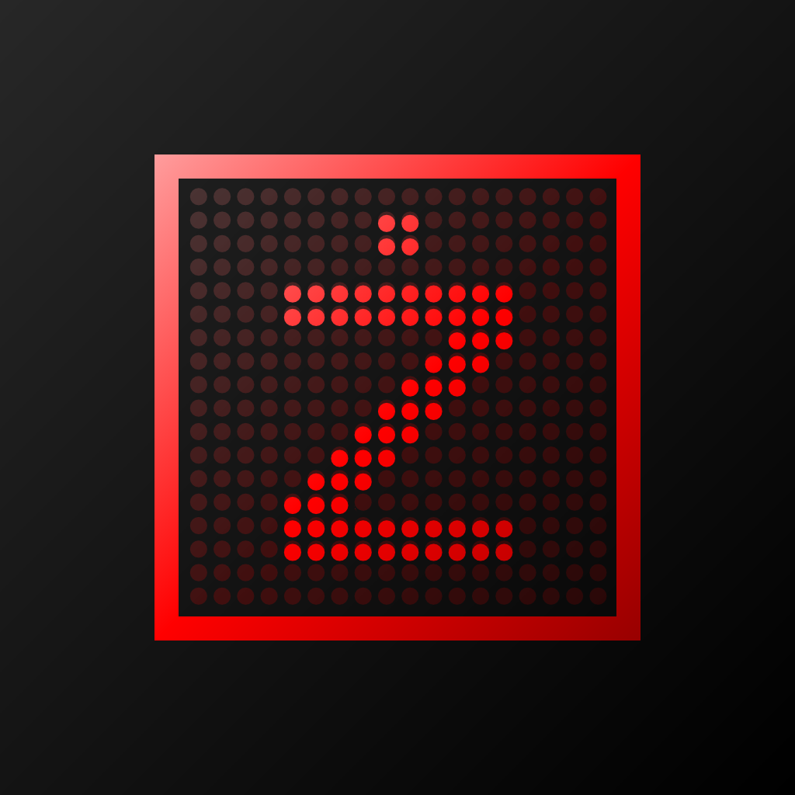
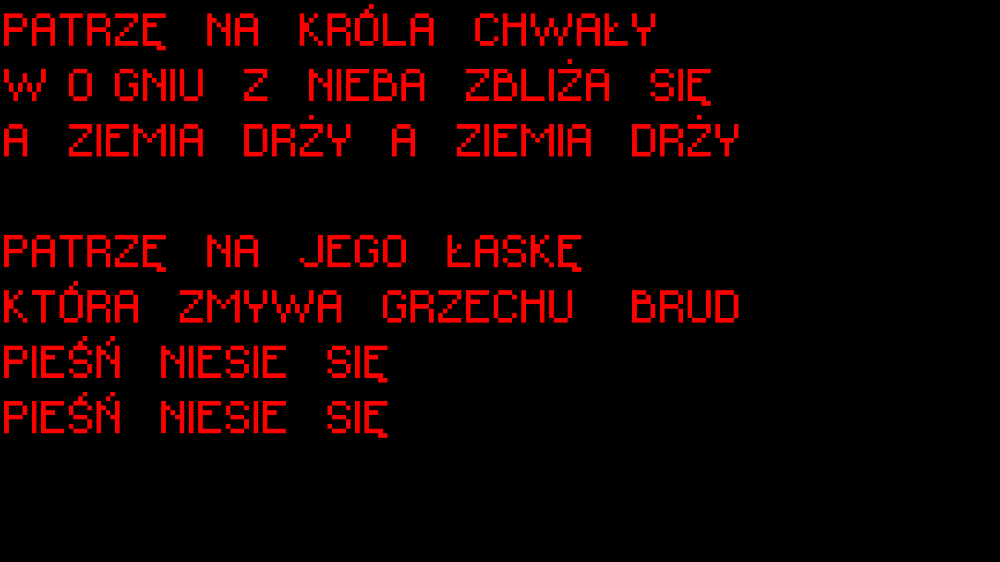
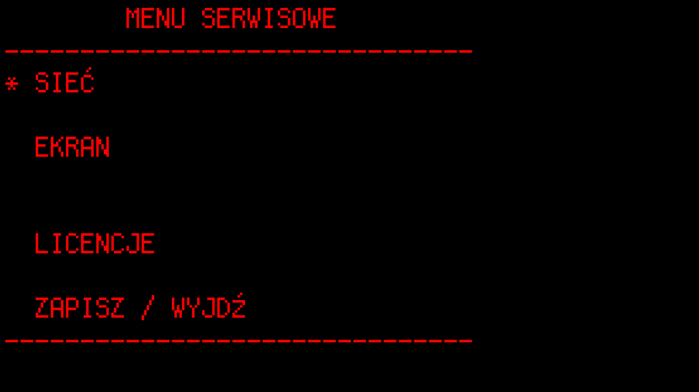
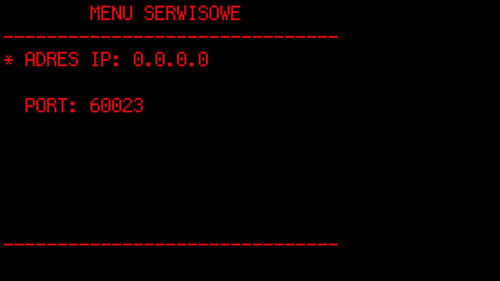
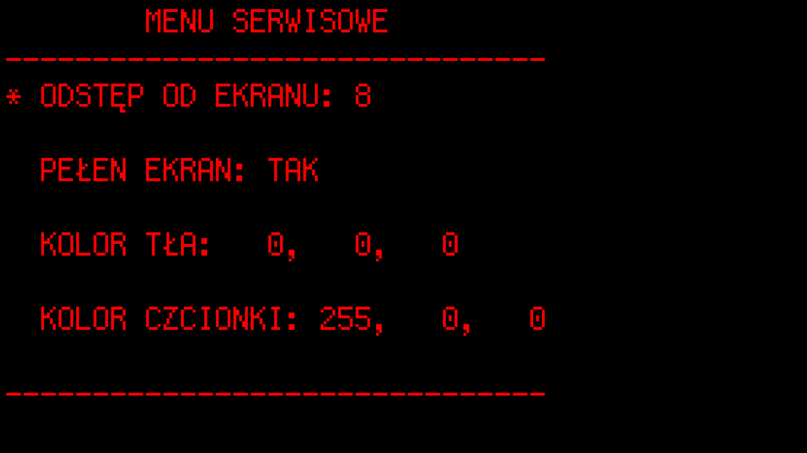
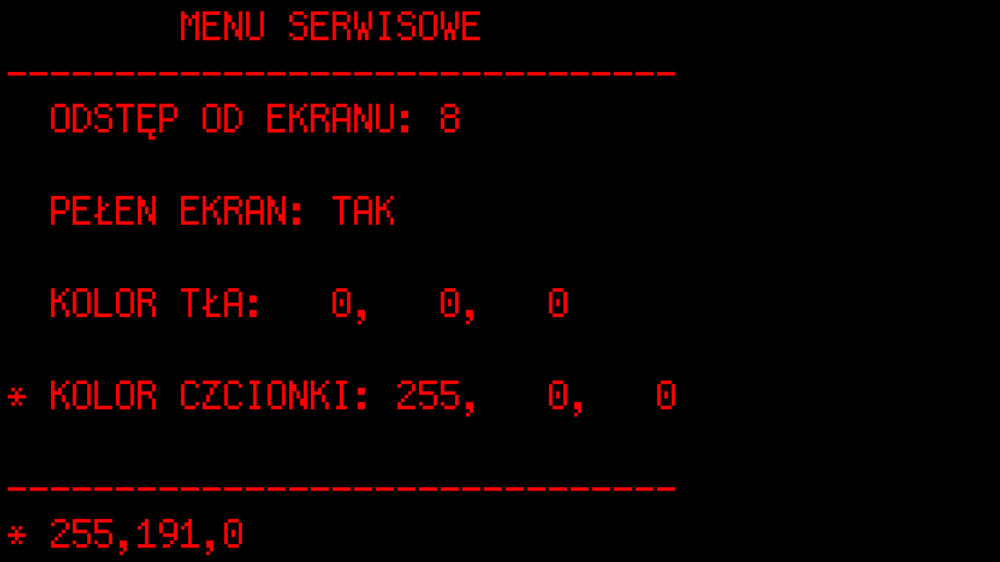
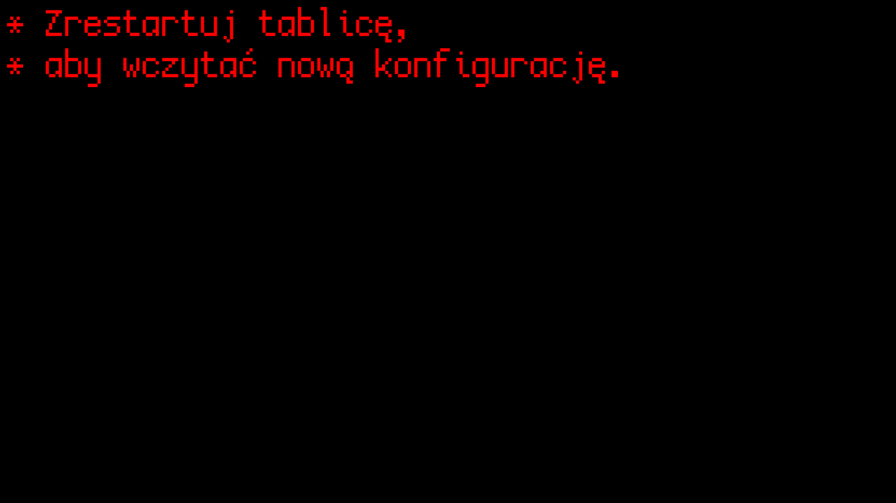

<p align="center"></p>
<h1 align="center">Tablica Znakowa</h1>
<p align="center">Tablica Znakowa is an emulator of the classic character LED display from MKEiA.</p>

<p align="center">
  
  
  
</p>

<p align="center">
   <a href="https://github.com/ZupaNET/tablica-znakowa/blob/master/README_PL.md">
     
   </a>
</p>

<p align="center">
 <a href="https://github.com/ZupaNET/tablica-znakowa/releases">
   <image src="https://i.ibb.co/q0mdc4Z/get-it-on-github.png" height="80"/>
 </a>
</p>

## Overview

Tablica Znakowa is a simple, lightweight, and open-source emulator of the LED display panel formerly manufactured by MKEiA for displaying church hymns.

- Compatible with MKEiA apps: Edytor Pieśni and mobile Pieśni!
- Built-in fonts used on the actual display panel!
- A service menu for easy display configuration via keyboard or remote control!
- Support for the most popular platforms for display boards: Windows, Linux, and Android TV!
- Small app size and few dependencies!

**Note!** Tablica Znakowa is only an emulator! It has no memory of its own and cannot display anything on its own.
For full functionality, you’ll also need a client app: *Pieśni* or *Edytor Pieśni* from MKEiA, or [*Kontroler*](https://github.com/ZupaNET/tablica-znakowa-controller) from ŻupaNET Development.

<p align=center>
  
  
  
  
  
  
  
  
  
</p>

## Installation

The application does not require any additional dependencies to run other than those included with it.
Detailed installation instructions for each platform are available below.

#### Windows, Android, Debian-alike, AlmaLinux-alike

Download the installer/package from the **Releases** tab that corresponds to your architecture, and install/extract it.
For Debian (and derivatives) and Alma Linux (and derivatives), the application was built on Debian 13
and AlmaLinux OS 10—please take this into account when installing DEB/RPM packages on derivative systems.

> **NOTE!** As of July 27, 2026, the SDL3_net library is in the testing phase in the Debian repositories. You may need to
> add the testing repository or install the SDL3_net library DEB package directly. More information [here](https://wiki.debian.org/DebianExperimental).

### Other Linux Systems

Due to the nature of the application, it is recommended that you compile it on the target platform. See [**Compilation**](#compilation)

## Configuration

The Character Table requires no additional configuration. It is ready to use as soon as it is launched. By default, it listens on
all IP addresses and on port **60023**. On Windows and Linux, you can change certain settings in the configuration file:

- Windows: `%appdata%\ŻupaNET Development\Tablica Znakowa\tablica.ini`
- Linux: `~/.local/config/ŻupaNET Development/Tablica Znakowa/tablica.ini`

On Android, it is not possible to easily modify the configuration file, so you must use the [**Service Menu**](#menu-serwisowe)

Configuration file description:
- `ip` - the IP address on which the character map listens
- `port` - the port on which the character map listens
- `padding` - the spacing (in pixels) between the text and the left and top edges of the screen
- `fullscreen` - enables full-screen mode (always enabled on Android)
- `background` - background color in hex format (e.g., #000000)
- `foreground` - font color in hex format (e.g., #FF0000)

Sample configuration file:
```ini
[server]
ip=0.0.0.0
port=60023

[display]
padding=8
fullscreen=0
background=#000000
foreground=#ff0000
```

# Service Menu

> **Note!** Currently the Service Menu is available only in Polish!

For Android-based systems (primarily TVs) and in cases where system files cannot be modified, a
service menu has been provided that allows you to change the settings listed above. To access the service menu, after
starting the device, press the following combination within 5 seconds: **UP UP DOWN DOWN LEFT RIGHT LEFT RIGHT OK/ENTER**. You can
exit the menu without saving by pressing **ESC/BACK**. Use the D-pad or arrow keys to navigate the menu. Pressing OK/ENTER selects
an option, while ESC/BACK cancels the selection.

After selecting an option for editing, you can enter numbers using the numeric keypad. Press OK/ENTER to confirm, and ESC/BACK
to delete the last digit/character. If you delete all digits/characters, pressing ESC/BACK again will cancel the option editing.

**When entering an IP address or color, pressing the RIGHT button will insert a period or comma, respectively.**

After saving the settings, the display will return to view mode, but the new settings will not take effect until the
application is restarted.

**You can also exit the app in display mode by pressing ESC/BACK**.

# Compilation

Compiling the application for all platforms is very simple, but you’ll need to install the necessary tools first.
For Windows, it is recommended to install the **LLVM+CLang+MinGW** compiler (e.g., [this one](https://github.com/mstorsjo/llvm-mingw) — **preferably using WinGet**),
as well as the **CMake** tool and any **Python** interpreter (required for compiling SDL3). For Linux,
we use a compiler of our choice (either our own or one from a repository) and, if desired, the SDL3 libraries from the distribution’s repository.
For Android, we’ll use what Google Inc. has provided. Tablica Znakowa will work on anything that supports SDL3, SDL3_ttf, and SDL3_net. For Windows, InnoSetup will also come in handy
if you’re interested in generating installers.

### Installing Dependencies

If we are compiling SDL3 for X11/Wayland from source as part of the project, we must also install the required dependencies listed on the [libSDL wiki](https://wiki.libsdl.org/SDL3/README-linux#build-dependencies).
If you’re not interested in X11/Wayland, you can add the `-DSDL_UNIX_CONSOLE_BUILD=ON` option to the `cmake` command from step 2.

#### Debian / Ubuntu / Linux Mint and derivatives

```sh
sudo apt install build-essential git make \
pkg-config cmake ninja-build libsdl3-dev \
libsdl3-ttf-dev libsdl3-net-dev
```

#### Alma Linux OS / Rocky Linux / RHEL and derivatives

```sh
sudo dnf install git gcc gcc-c++ cmake \
    ninja-build pkgconf-pkg-config rpmdevtools
```
If your distribution allows it, you can try installing SDL3 from the RPM repositories: `sudo dnf install SDL3-devel SDL3_ttf-devel SDL3_net-devel`.
Unfortunately, as of July 27, 2026, RHEL and its derivatives do not provide SDL3 at all, while Fedora does.

### The Correct Process - Windows and Linux
1. Clone the repository: `git clone https://github.com/ZupaNET/tablica-znakowa.git`
2. Run the appropriate CMake preset from the project's root directory: `cmake --preset <name>` (you can view the list with: `cmake --list-presets`). Optionally, add `-DSDL_UNIX_CONSOLE_BUILD=ON`
3. Compile the project: `cmake --build --preset <name>` (you can view the list with: `cmake --build --list-presets`)

If everything goes well, the application will be built in the following directory:
- Windows: `build/<preset>/bin`
- Linux: the main executable and resources in `build/<preset>/bin`, and libraries in `build/<preset>/lib`

To build DEB, RPM, TGZ (Linux), or ZIP packages, as well as an Inno Setup installer (Windows), navigate to the `build/<preset>/` directory,
then run the command `cpack -G <package>`, where `<package>` can be **DEB**, **RPM**, **TGZ**, **ZIP**, or **INNOSETUP**.
The built installer/package will be located in the same directory.

On Linux systems, you can also install the application immediately by running the command `cmake --install build/<preset>`. **Note!**
This command will **NOT** install the SDL libraries in `/usr/lib64/` if they were compiled as part of the project and you did not use
the ones provided with the distribution. You must manually copy them to the appropriate directory.

### The Correct Process - Android

1. Clone the repository: `git clone https://github.com/ZupaNET/tablica-znakowa.git`
2. Open a terminal in the repository with the Android SDK environment configured and the variables `ANDROID_KEYSTORE`, `ANDROID_KEYSTORE_PASSWORD`, `ANDROID_KEY_ALIAS`, and `ANDROID_KEY_PASSWORD` set
3. Navigate to the `android` directory and run the command: `gradlew assembleRelease` or `gradlew assembleDebug` (for the Debug version).
4. An APK file will be generated in the `app\build\outputs\apk\<debug/release>` directory for the `x86_64`, `arm64-v8a`, and `armeabi-v7a` platforms.

# License

<p>Copyright (C) 2026 ŻupaNET Development

This program is free software: you can redistribute it and/or modify
it under the terms of the GNU General Public License as published by
the Free Software Foundation version 2 of the License.

This program is distributed in the hope that it will be useful,
but WITHOUT ANY WARRANTY; without even the implied warranty of
MERCHANTABILITY or FITNESS FOR A PARTICULAR PURPOSE. See the
GNU General Public License for more details.

The above copyright notice, this permission notice, and its license shall be included in all copies or substantial portions of the Software.

You can find a copy of the GNU General Public License v2 [here](https://www.gnu.org/licenses/)</p>

## Third-Party Libraries and Resources

Information about the licenses for third-party libraries and resources used in the project can be found in the [THIRD_PARTY_LICENSES.md](THIRD_PARTY_LICENSES.md) file